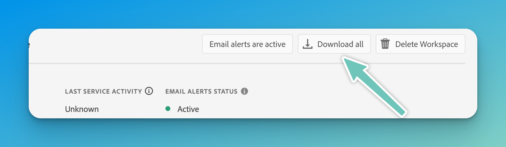

# Week 2: Environment Setup & First App

**Goal:** Ensure participants can set up their environment, install necessary tools, connect to Adobe IO, and run their first App Builder project.

## Quick Navigation

-   [Step 1: Getting Access to Adobe IO](#step-1-getting-access-to-adobe-io)
-   [Step 2: Installing Development Tools](#step-2-installing-development-tools)
-   [Step 3: Creating Your Repository from the Template](#step-3-creating-your-repository-from-the-template)
-   [Step 4: Setting Up Credentials](#step-4-setting-up-credentials)
-   [Step 5: Running The App Locally](#step-5-running-the-app-locally)
-   [Step 6: Debugging & Logs](#step-6-debugging--logs)
-   [Completion Checklist](#completion-checklist)
-   [Next Steps](#next-steps)

---

## Step 1: Getting Access to Adobe IO

Before using Adobe App Builder, you need access to an **Adobe Developer Project**.

1. Go to the **[Adobe Developer Console](https://developer.adobe.com/console/)**.
2. Click **Create New Project** → Select **App Builder**.
3. Give it a name like `Adobe App Builder Enablement`
4. Download the credentials file
   

---

## Step 2: Installing Development Tools

Ensure you have the necessary development tools installed. You'll run most of these commands in your `terminal` application.

### 1. Install Node.js

Ensure you have Node.js **18+** installed. Check by running:

```sh
node -v
```

If needed, install from [Node.js Downloads](https://nodejs.org/).

### 2. Install Adobe I/O CLI

Use Node.js to install the Adobe CLI via **npm**:

```sh
npm install -g @adobe/aio-cli
```

Verify installation:

```sh
aio -v
```

### 3. Install AIO Extras

#### API Mesh - Plugin

Install the plugin that enables API Mesh configs.

```sh
aio plugins:install @adobe/aio-cli-plugin-api-mesh
```

#### State Storage

Install the module that enables State Storage.

```sh
npm install @adobe/aio-lib-state
```

#### File Storage

Install the module that enables File Storage.

```sh
npm install @adobe/aio-lib-files
```

### 4. _Optional: Install an IDE_

For a better development experience, install a code editor like **Visual Studio Code** or **Cursor**.

-   [Visual Studio Code](https://code.visualstudio.com/download)
-   [Cursor](https://cursor.sh/) (AI-powered VS Code fork)

#### Quick install Mac (Homebrew Install for VS Code)

If you use **macOS** and have **Homebrew**, install VS Code with:

```sh
brew install --cask visual-studio-code
```

---

## Step 3: Creating Your Repository from the Template

You'll be working with a **pre-configured GitHub repository** that contains all exercises. Instead of cloning directly, you'll create your own copy using GitHub's template feature.

### 1. Create Your Own Repository

-   Visit the **[Adobe App Builder Enablement Template](https://github.com/pseudovar/adobe-app-builder-enablement)** on GitHub.
-   Click the **"Use this template"** button.
-   Select **"Create a new repository"**, give it a name, and click **"Create repository from template"**.

### 2. Clone Your Repository Locally

Replace `<your-repo-name>` with your chosen repository name:

```sh
   git clone https://github.com/YOUR-GITHUB-USERNAME/<your-repo-name>.git
```

### 3. Move into the project folder:

```sh
cd <your-repo-name>
```

### 4. Install dependencies:

```sh
npm install
```

### 5. _Optional: Open your project in your IDEA_

Either open the application and load your current folder, or for Visual Studio Code, you can open it from the `terminal`.

```sh
code ./
```

For future commands you can either continue running them in `terminal` or you can use the built in `terminal` in your IDE.

For Visual Studio Code, you can open the terminal by selecting View > Terminal from the menu bar, or by pressing the <kbd>Ctrl+`</kbd> keyboard shortcut

---

## Step 4: Setting Up Credentials

### 1. Login using the AIO CLI Tool

```sh
aio login
```

This may open a browser window for you to sign into your Adobe Developer Console. Make sure to use the same account and Organisation that you previously used to create the project.

#### If you get an error message

If you get an error message, you may need to logout and try again.

```sh
aio logout
```

### 2. Setting up Console

You need to let **Adobe I/O CLI** know where to deploy your app.

To do this we need to tell the console which org, project and workspace we're working on.

Use the following commands to configure your console.

#### Your current configuration

```sh
aio console where
```

#### Select a Org

```sh
aio console org select
```

#### Select a Project

```sh
aio console project select
```

#### Select a Workspace

```sh
aio console workspace select
```

### 3. Create .aio and .env files

You can create these manually, but the easiest way now that you're logged into **Adobe I/O CLI** is to run

```sh
aio app use -m
```

---

## Step 5: Running The App Locally

1. Start the local App Builder environment:

```sh
aio app dev
```

2. Open in a browser: **http://localhost:9080**.
3. You should see a basic App Builder page.

---

## Completion Checklist

☑️ I have **created a new repository** from the GitHub template and cloned it locally.  
☑️ I have **created a project in Adobe Developer Console** and noted my credentials.  
☑️ I have **installed the required tools** (Adobe I/O CLI, Node.js, dependencies).  
☑️ I have **configured App Builder credentials** in the `.env` file.  
☑️ I have **initialized the app using `aio app init` and linked it to my Adobe IO project**.  
☑️ I have **run the app locally** and confirmed it loads in the browser.

---

## Next Steps

In [**Week 3**](./Week3.md), we'll add a **serverless action** that generates **random user data** and displays it in the UI.
