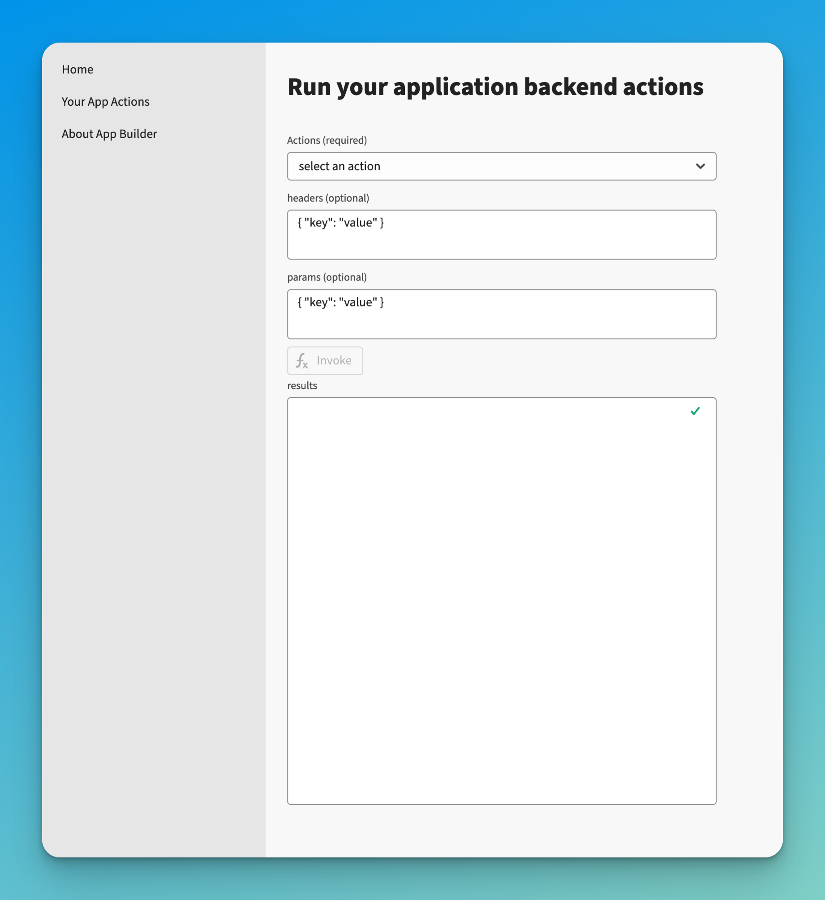
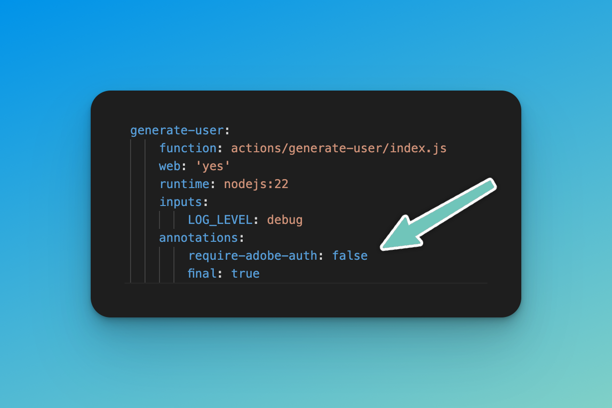
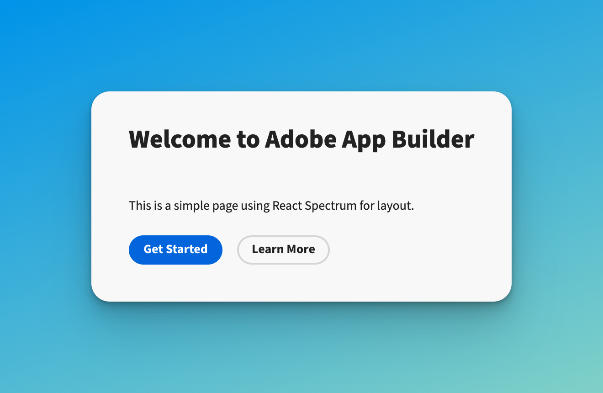
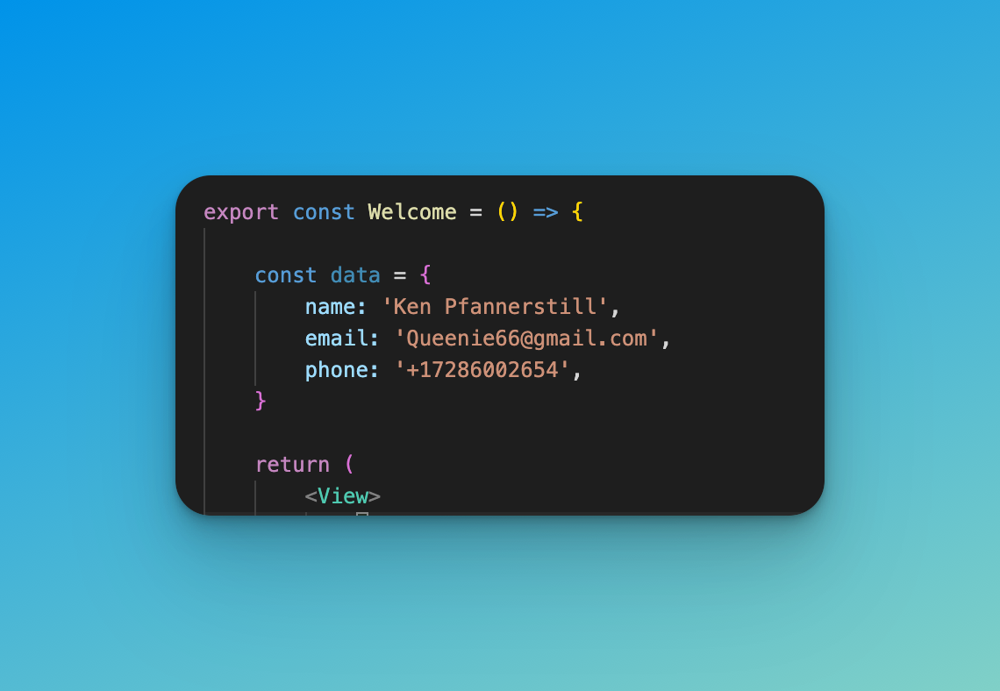

# Week 3: Working with Actions & UI

**Goal:** Learn how to test, modify, and create serverless actions within Adobe App Builder. This includes testing the existing action, creating a new action, and connecting the UI to display results dynamically.

## Quick Navigation

-   [Step 1: Testing the Existing Action](#step-1-testing-the-existing-action)
-   [Step 2: Modifying the Existing Action](#step-2-modifying-the-existing-action)
-   [Step 3: Creating a New Action with FakerJS](#step-3-creating-a-new-action-with-fakerjs)
-   [Step 4: Connecting Actions to the UI](#step-4-connecting-actions-to-the-ui)
-   [Completion Checklist](#completion-checklist)
-   [Next Steps](#next-steps)

---

## Step 1: Testing the Existing Action

Before creating an action, let's test the **default App Builder action** using the built-in "**Your App Actions**" tool.

1. **Start the App Builder project locally:**
    ```sh
    aio app run
    ```

> 🗒️ **How to exit**
>
> Use <kbd>CTRL+C</kbd> to exit any running command

2. **Open the app** in a browser at **http://localhost:9080**.
3. Click on "**Your App Actions**" from the sidebar.
4. You should see a **Run your application backend actions** section.
   
5. In the `Actions` dropdown, select `dx-excshell-1/generic`
6. Click the **Invoke** button.
7. Observe the response in the `Results` box; this is executing a **serverless function in Adobe's infrastructure**.

> 💬 **What do you see?**
>
> Discuss why this might be.

8. Add the following JSON headers:

```JSON
{
    "authorization":"Bearer abcde",
    "x-gw-ims-org-id": "12345"
}
```

9. Click the **Invoke** button.

> 💬 **Now, what do you see?**
>
> Discuss why this might be.

---

## Step 2: Modifying the Existing Action

Now, let's modify the existing action to see how changes take effect.

1. Open `src/dx-excshell-1/actions/generic/index.js` in your code editor.
2. Find the default function:
    ```js
    const content = await res.json()
    ```
3. Modify it to return a **custom message**:

    ```js
    let content = await res.json()
    // Add an additional message
    content = {
        ...content,

        message: 'Hello World',
    }
    ```

4. Save the `action` and go back to "**Your App Actions**" and **Invoke** the action again.
5. You should see the updated message in the response.

---

## Step 3: Creating a New Action

We're going to create a new action that will use an NPM library to generate random user details that can be fetched through an API.

### Add a new Action

1. Install FakerJS:
    ```sh
    npm install @faker-js/faker
    ```
2. Create a new action inside `actions/`:
    ```sh
    aio app add action
    ```
3. Select `All Action Templates`
4. Use <kbd>↑</kbd> & <kbd>↓</kbd> to select `@adobe/generator-add-action-generic`
5. Use <kbd>SPACE</kbd> to select and <kbd>RETURN</kbd> to proceed.
6. Enter the name `generate-user`

### Your custom Action

1. Open `src/dx-excshell-1/ext.config.yaml` and find `runtimeManifest -> packages -> dx-excshell-1 -> actions -> generate-user -> annotations -> require-adobe-auth` and set it to `false`



More details about [require-adobe-auth](https://developer.adobe.com/app-builder/docs/guides/configuration/#annotations) available in the docs.

2. Open `src/dx-excshell-1/actions/generate-user/index.js` and replace its contents with:

```js
const { Core } = require('@adobe/aio-sdk')
const { errorResponse } = require('../utils')
const { faker } = require('@faker-js/faker')

async function main(params) {
    const logger = Core.Logger('main', { level: params.LOG_LEVEL || 'info' })

    try {
        logger.info('Calling the main action')

        const data = {
            name: faker.person.fullName(),
            email: faker.internet.email(),
            phone: faker.phone.number({ style: 'international' }),
        }

        logger.info('Generated data')

        const response = {
            statusCode: 200,
            body: data,
        }

        logger.info(`${response.statusCode}: successful request`)
        return response
    } catch (error) {
        logger.error(error)
        return errorResponse(500, 'server error', logger)
    }
}

exports.main = main
```

3. Save the file and you should see:
    ```sh
    info: Build was successful for: generate-user
    ```
4. **Test the action** using "Your App Actions":
    - It should now return a **random user** each time you run it.
5. **_Optional_** Try adding more data using the [faker library](https://fakerjs.dev/api/).

> 👏 **You've created your first App Builder Action**
> Can you explain what the code is doing?

---

## Step 4: Adding a new page

Now, let's create a **new page** using [React Spectrum](https://react-spectrum.adobe.com/react-spectrum/getting-started.html) to structure the layout.

React Spectrum is a set of [React](https://react.dev/) components that stick to the accessibility and design standards setout by [Adobe Spectrum](https://spectrum.adobe.com/).

1. **Create a new page component** inside `src/dx-excshell-1/web-src/src/pages/Welcome.js`:

```js
import React from 'react'
import { Flex, View, Heading, Content } from '@adobe/react-spectrum'

export const Welcome = () => {
    return (
        <View>
            <Flex direction="column" gap="size-100">
                <Heading level={1}>Welcome to Adobe App Builder</Heading>
                <Content>
                    <p>
                        This is a simple page using React Spectrum for layout.
                    </p>
                </Content>
            </Flex>
        </View>
    )
}
```

2. **Add the page** to the Router
   By default, App Builder uses [React HashRouter](https://api.reactrouter.com/v7/functions/react_router.HashRouter.html) to know what to show to the user and when. It's not the best option for production applications, but it does work.
   Modify `web-src/src/layouts/App.js` to add your new page:

```js
...
import { About } from '../pages/About'
import { Welcome } from '../pages/Welcome'
import { Tickets } from '../pages/Tickets'
...
<Route path="/about" element={<About />} />
<Route path="/welcome" element={<Welcome />} />
<Route path="/tickets" element={<Tickets />} />
...
```

3. You may need to restart you **local dev environment** using <kbd>CTRL+C</kbd> and then running `aio app dev`.

4. Next we're going to add some buttons. Fortunately, we have [Button Group](https://react-spectrum.adobe.com/react-spectrum/ButtonGroup.html) and [Button](https://react-spectrum.adobe.com/react-spectrum/Button.html) components within React Spectrum.
   This means we don't have to create and style the buttons ourselves, and it will look like part of an Adobe application.
   Add `ButtonGroup` and `Button` to the `import`

```js
...
import {
    Flex,
    View,
    Heading,
    Content,
    ButtonGroup,
    Button,
} from '@adobe/react-spectrum'
```

5. And, then add the components under the `</Content>` tag.

```js
...
    </Content>
    <ButtonGroup>
        <Button variant="cta">Get Started</Button>
        <Button variant="secondary">Learn More</Button>
    </ButtonGroup>
</Flex>
...
```

6. Your page should now have two buttons displayed nicely.
   

7. These buttons don't really do anything at the moment, but notice that we have `:hover` and interaction states. That all comes from the React Spectrum components.
8. Add the following `onPress` event to the **Get Started** button:

```js
onPress={() => {
    console.log('Get Started')
}}
```

9. And, add the following `onPress` event to the **Learn More** button:

```js
onPress={() =>
    window.alert(
        'Adobe App Builder lets you build and extend Adobe solutions using serverless functions, UI, and APIs!'
    )
}
```

---

## Step 5: Writing some code

1. Go to "Your App Actions" and get the JSON output from your `generate-user` action.
   The JSON is only what is between the `curly braces {}` in this instance.

2. Copy and paste this into your `Welcome.js` file and assign it to a variable called `data`.



> 🗒️ **Different types of variables**
>
> In JavaScript there are [different types of variables](https://www.geeksforgeeks.org/difference-between-var-let-and-const-keywords-in-javascript/). For this enablement, just focus on 'const' (immutable) and 'let' (mutable).

3. Now let's display the data using existing components.
   Add the following anywhere in the `return ()` of the `Welcome.js` component.

```js
<Flex>
    <View
        backgroundColor={'static-white'}
        borderColor={'dark'}
        borderWidth={'thin'}
        padding={'size-200'}
        borderRadius={'medium'}
    >
        <Heading level={3}>User Profile</Heading>

        <ProgressBar label="Profile Completion" value={50} />
        <Flex direction="row" gap="size-200" marginY={'size-300'}>
            <LabeledValue label="Name" value={data.name} />
            <LabeledValue label="Email" value={data.email} />
            <LabeledValue label="Phone" value={data.phone} />
        </Flex>
    </View>
</Flex>
```

> 💬 **Did you get an error?**
>
> What might be causing it? Check the development server logs in `terminal` to find more information.

---

## Step 6: Connecting Actions to the UI

Now, let's **connect an Action to a UI** to display random user data.

1. Create a new action called `generate-flight` using the previous **Adobe I/O CLI** instructions.

2. Replace the action code with:

```js
const { Core } = require('@adobe/aio-sdk')
const { errorResponse } = require('../utils')
const { faker } = require('@faker-js/faker')

async function main(params) {
    const logger = Core.Logger('main', { level: params.LOG_LEVEL || 'info' })

    try {
        logger.info('Calling the main action')

        const userFlightData = {
            name: faker.person.fullName(),
            email: faker.internet.email(),
            phone: faker.phone.number(),
            flightNumber: faker.airline.flightNumber(),
            departure: faker.airline.airport(),
            arrival: faker.airline.airport(),
            departureTime: faker.date.future(),
        }

        logger.info('Generated user flight data')

        const response = {
            statusCode: 200,
            body: userFlightData,
        }

        logger.info(`${response.statusCode}: successful request`)
        return response
    } catch (error) {
        logger.error(error)
        return errorResponse(500, 'server error', logger)
    }
}

exports.main = main
```

3. Make sure to either remove `require-adobe-auth` or set it to `false`

> 💬 **What is happening in this action?**
>
> Can you explain what it's doing?
> How can we test that our action is working?

4. Restart the app (if needed)
5. Navigate to [Tickets](https://localhost:9080/#/tickets)

> 💬 **What happens?**
>
> What is happening when the page loads? What happens when you click the buttons? Can you see how that is interacting with the API?

---

## Completion Checklist

☑️ I have **created a new page (`Welcome.js`) using React Spectrum components**.  
☑️ I have **defined and displayed static user data (name, email, phone) inside the layout**.  
☑️ I have **structured the page with headings, content, and buttons** using React Spectrum.  
☑️ I have **tested the page locally in the browser (`http://localhost:9080/welcome`)**.

Once all steps are completed, you're ready for **Step 6: Fetching Data Dynamically from an API Action**.

---

## Next Steps

In [**Week 4**](./Week4.md), we'll:

-   Deploy the app to **Adobe I/O production**.
-   Deploy using **GitHub Actions**

### Extra Challenge

Create a **new page** (e.g., `Playground.js`) and explore more **React Spectrum components**. Try adding:

-   A **TextField** for user input.
-   A **Switch** to toggle a feature on/off.
-   A **ProgressBar** with a random value.
-   A **Slider** to adjust a setting.

Update the router in **`App.js`** to link to this new page.

This will help you get comfortable using different UI elements **before moving on to data persistence in Week 4**.
