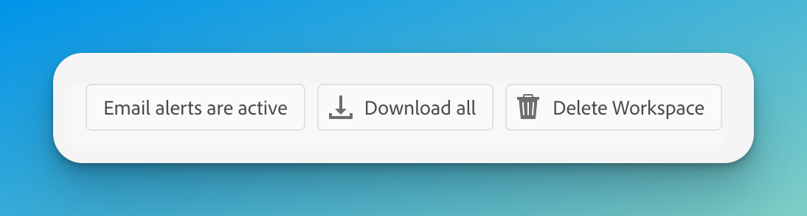
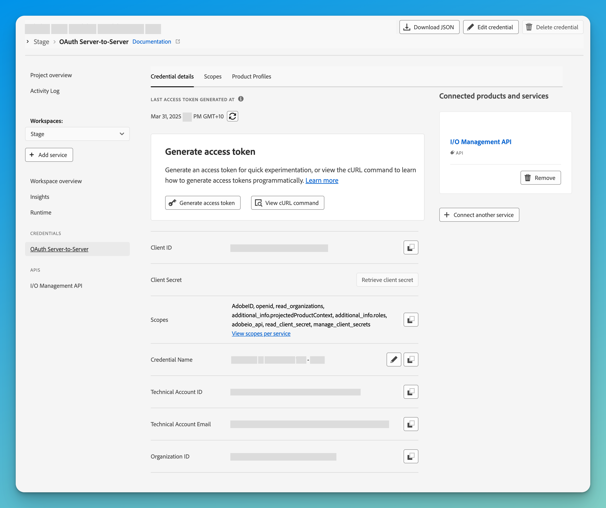

# Week 4: Deploying & Using Storage

**Goal:** Learn how to:

-   Deploy manualls
-   Create credentials for automatic deployments
-   Deploy your project manually and via GitHub Actions.

---

## Quick Navigation

-   [Step 1: Deploying the App Manually](#step-1-deploying-the-app-manually)
-   [Step 2: Configuring GitHub Actions for Deployment](#step-2-configuring-github-actions-for-deployment)
-   [Completion Checklist](#completion-checklist)
-   [Next Steps](#next-steps)

---

## Step 1: Deploying the App Manually

First, let's deploy the app manually to **Adobe I/O Runtime**.

1. Run the following command:
    ```sh
    aio app deploy
    ```
2. Use copy & paste, or <kbd>CMD+Click</kbd> to open your application link, either directly or within the Experience Cloud Shell.
   Test out some of your pages and actions.
3. Take your `generated-user` action URL, and run it in [PostBuster](https://adobe.service-now.com/esc?id=adb_esc_kb_article&sysparm_article=KB0020542) or [Postman](https://adobe.service-now.com/esc?id=adb_esc_sc_cat_item&sys_id=b0fd78a097cadd10c8eeb7e3a253afe3)

> 🎉 **Your app is now be accessible online!**
> Your can even try calling your **action APIs** from [Adobe Workfront Fusion](https://experience.adobe.com/#/so:WorkfrontFusion4924/fusion) and [Microsoft Power Automate](https://make.powerautomate.com/).

---

## Step 2: Configuring GitHub Actions for Deployment

Most Continuous Integration/Continuous Deployment involves a pipeline for deployment so it's fast and repeatable. The default with App Builder is [GitHub Actions](https://github.com/features/actions), however, these can be translated to any other platform.

### 1. Extensions vs Standalone Apps

There are two type of App Builder Apps. It's not always clear which is which, especially if you start from a template.

**Standalone App**
Single Page Applications (SPAs) that can be accessed in Experience Cloud UI, and standalone Headless Applications.

**[Extension App](https://developer.adobe.com/app-builder/docs/guides/extensions/)**
More integrated way to extend Adobe products through App Builder. For instance, AEM Asset Microservices that allow developers to build Custom Processing Profile as App Builder applications.

**Which is which?**
Open your `app.config.yaml` file and the root node is either `application` or `extension`.

### 2. Accessing Credentials

If your App Builder App is a `standalone application`, then your deployment is relatively simple, and you only need:

-   AIO_RUNTIME_NAMESPACE - namespace to be used for the App
-   AIO_RUNTIME_AUTH - auth for above namespace

If your App Builder App is an `extension` then you will need to create some an OAuth Server-to-Server credential.

1. Navigate to [https://developer.adobe.com/console/](https://developer.adobe.com/console/) and locate your project.
2. Select a Workspace, for example `Stage`
3. Add a Service -> API
4. Choose I/O Management API and complete the credentials form
5. Once completed, `Download All` button to get a JSON file with all the details you'll need.
   
6. The rest of the items can be found by clicking into the `OAuth Server-toServer` credentials
   

### 3. Add Required GitHub Secrets

Since this repository already includes a **GitHub Actions workflow**, let's configure it to automatically deploy on every push.

Go to **GitHub Repo** → **Settings** → **Secrets and variables** → **Actions** → **New repository secret**, then add the following:

| **Secret Name**                    | **Example**                                                               | **Location**        |
| ---------------------------------- | ------------------------------------------------------------------------- | ------------------- |
| `AIO_PROJECT_ID_STAGE`             | `0000000000000000`                                                        | credentials.json    |
| `AIO_PROJECT_NAME_STAGE`           | `000AaaaaaaAaaaaaa`                                                       | credentials.json    |
| `AIO_PROJECT_ORG_ID_STAGE`         | `00000`                                                                   | credentials.json    |
| `AIO_PROJECT_WORKSPACE_ID_STAGE`   | `0000000000000000000`                                                     | credentials.json    |
| `AIO_PROJECT_WORKSPACE_NAME_STAGE` | `Stage`                                                                   | credentials.json    |
| `AIO_RUNTIME_AUTH_STAGE`           | `a0a0a0a0-a0a0-a0a0-a0a0-a0a0a0a0a0a0:a0a0a0a0a0a0a0a0a0a0a0a0a0a0a0a0a0` | credentials.json    |
| `AIO_RUNTIME_NAMESPACE_STAGE`      | `00000-000aaaaaaaaaaaa-stage`                                             | credentials.json    |
| `IMSORGID_STAGE`                   | `0A0A0A0A0A0A0A0A0A0A0A0A@AdobeOrg`                                       | credentials.json    |
| `CLIENTID_STAGE`                   | `a0a0a0a0a0a0a0a0a0a0a0a0a0a0a0a0`                                        | Console Credentials |
| `CLIENTSECRET_STAGE`               | `a0a-0a0a0a0a0a0a0a0a0a0a0a0a0a0a0a0a`                                    | Console Credentials |
| `SCOPES_STAGE`                     | `AdobeID, openid, read_organizations, addit...`                           | Console Credentials |
| `TECHNICALACCEMAIL_STAGE`          | `0a0a0a0a0a00a0a@techacct.adobe.com`                                      | Console Credentials |
| `TECHNICALACCID_STAGE`             | `0a0a0a0a0a00a0a@techacct.adobe.com`                                      | Console Credentials |

### **4. Triggering a Deployment via GitHub Actions**

Once the secrets are in place, GitHub Actions will **automatically deploy on push to main**.

Push changes to `main`:

```sh
git add .
git commit -m "Deploying via GitHub Actions"
git push origin main
```

Then, check your **GitHub Actions workflow** under **GitHub → Actions**.

---

## Completion Checklist

☑️ I have **deployed the app manually using `aio app deploy`**.  
☑️ I have **configured GitHub Secrets to enable GitHub Actions deployments**.

Once all steps are completed, you're ready for **Week 5: Event-Driven Development!** 🚀

---

## Next Steps

In [**Week 5**](./Week5.md), we will:

-   Explore how to use **Adobe App Builder Storage**.
-   Learn the differences between **State Storage** (ideal for fast, transactional key/value data) and **File Storage** (larger files and long-term storage).
-   Create an example using each:
    -   Cache and retrieve the **last generated user** with **State Storage**.
    -   Generate and store a **CSV report** with **File Storage**, and retrieve it later.
